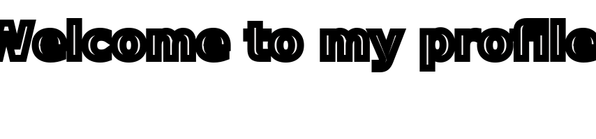
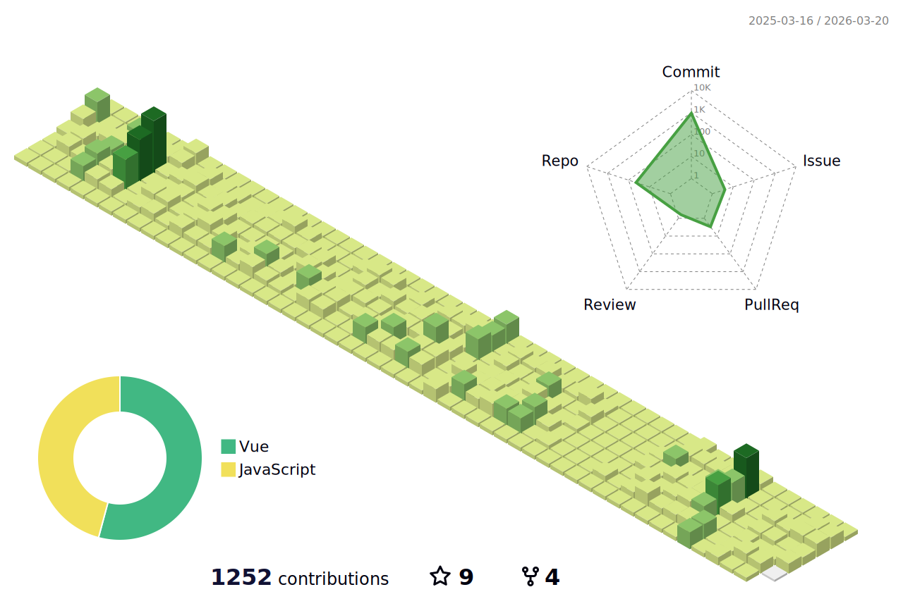

<!--   my-ticker -->     
 

<!--   grid-snake --> 
  

| .                                                                                                                                        | .                                                                                                                                       | .                                                                                                                         | 
 |-----------------------------------------------------------------------------------------------------------------------------------------|---------------------------------------------------------------------------------------------------------------------------|---------------------------------------------------------------------------------------------------------------------------|  
 |  |  |  | 
  
 </img> 
  
 <!--   profile-green-animate --> 
  
  
 

<!--
**changweihua/changweihua** is a ✨ _special_ ✨ repository because its `README.md` (this file) appears on your GitHub profile.

Here are some ideas to get you started:

- 🔭 I’m currently working on ...
- 🌱 I’m currently learning ...
- 👯 I’m looking to collaborate on ...
- 🤔 I’m looking for help with ...
- 💬 Ask me about ...
- 📫 How to reach me: ...
- 😄 Pronouns: ...
- ⚡ Fun fact: ...
-->

- 🔭 I’m currently working on 苏南硕放机场阳光服务平台
- 🌱 I’m currently learning 微信小程序开发
- 👯 I’m looking to collaborate on 副业
- 🤔 I’m looking for help with ...
- 💬 Ask me about ...
- 📫 How to reach me: 微信号 changweihua2011
- 😄 Pronouns: ...
- ⚡ Fun fact: ...

