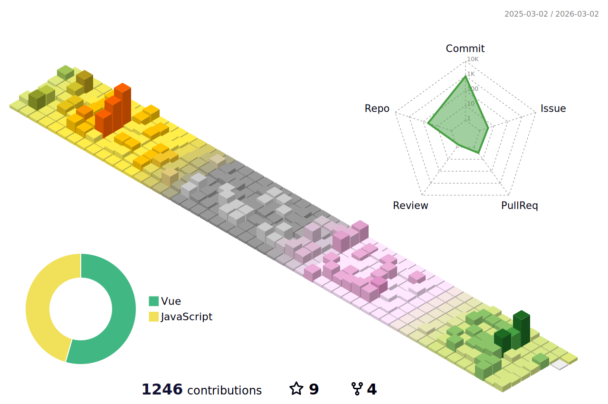

English | [中文](README_CN.md)

[](https://git.io/typing-svg)

<div style="display: grid;gap: 20px;grid-template-columns: repeat(auto-fit, minmax(240px, 1fr));">

[](https://metrics.lecoq.io/changweihua#gh-light-mode-only)

<div>

- 🔭 I’m currently working on maui-related
- 🌱 I’m currently learning 微信小程序开发
- 👯 I’m looking to collaborate on 副业
- 🤔 I’m looking for help with ...
- 💬 Ask me about ...
- 📫 How to reach me: changweihua@outlook.com
- 😄 Pronouns: ...
- ⚡ Fun fact: ...

</div>

</div>

#### :bar_chart: [月度工分](https://github.com/changweihua/wakapi)

<!--START_SECTION:wakao-->

```txt
Vue.js        35 hrs 47 mins  🟩🟩🟩🟩🟩🟩🟩🟩🟩🟩⬜⬜⬜⬜⬜⬜⬜⬜⬜⬜⬜⬜⬜⬜⬜   39.11 %
TypeScript    26 hrs 31 mins  🟩🟩🟩🟩🟩🟩🟩⬜⬜⬜⬜⬜⬜⬜⬜⬜⬜⬜⬜⬜⬜⬜⬜⬜⬜   29.00 %
Markdown      12 hrs 21 mins  🟩🟩🟩🟨⬜⬜⬜⬜⬜⬜⬜⬜⬜⬜⬜⬜⬜⬜⬜⬜⬜⬜⬜⬜⬜   13.50 %
JSON          7 hrs 11 mins   🟩🟩⬜⬜⬜⬜⬜⬜⬜⬜⬜⬜⬜⬜⬜⬜⬜⬜⬜⬜⬜⬜⬜⬜⬜   07.86 %
C#            2 hrs 30 mins   🟨⬜⬜⬜⬜⬜⬜⬜⬜⬜⬜⬜⬜⬜⬜⬜⬜⬜⬜⬜⬜⬜⬜⬜⬜   02.75 %
```

<!--END_SECTION:wakao-->

#### Stats ####


| .                                                                                                                                            | .                                                                                                                                      | .                                                                                                                                                     |
| -------------------------------------------------------------------------------------------------------------------------------------------- | -------------------------------------------------------------------------------------------------------------------------------------- | ----------------------------------------------------------------------------------------------------------------------------------------------------- |
|  |  |  |


#### Contrib ####

<!--   profile-green-animate -->


<!--START_SECTION:waka-->


**我是早起的 🐤** 

```text
🌞 早晨                     2759 commits        ██████████░░░░░░░░░░░░░░░   38.23 % 
🌆 白天                     2781 commits        ██████████░░░░░░░░░░░░░░░   38.53 % 
🌃 傍晚                     1458 commits        █████░░░░░░░░░░░░░░░░░░░░   20.20 % 
🌙 晚上                     219 commits         █░░░░░░░░░░░░░░░░░░░░░░░░   03.03 % 
```
📅 **我最有效率是在 星期二** 

```text
星期一                      1079 commits        ████░░░░░░░░░░░░░░░░░░░░░   14.95 % 
星期二                      1380 commits        █████░░░░░░░░░░░░░░░░░░░░   19.12 % 
星期三                      1294 commits        ████░░░░░░░░░░░░░░░░░░░░░   17.93 % 
星期四                      1173 commits        ████░░░░░░░░░░░░░░░░░░░░░   16.25 % 
星期五                      1110 commits        ████░░░░░░░░░░░░░░░░░░░░░   15.38 % 
星期六                      638 commits         ██░░░░░░░░░░░░░░░░░░░░░░░   08.84 % 
星期日                      543 commits         ██░░░░░░░░░░░░░░░░░░░░░░░   07.52 % 
```


📊 **本周消耗时间** 

```text
🕑︎ 时区: Asia/Shanghai

💬 编程语言: 
Vue.js                   15 hrs 15 mins      █████████████░░░░░░░░░░░░   53.50 % 
TypeScript               7 hrs 35 mins       ███████░░░░░░░░░░░░░░░░░░   26.61 % 
Markdown                 1 hr 52 mins        ██░░░░░░░░░░░░░░░░░░░░░░░   06.60 % 
JSON                     1 hr 18 mins        █░░░░░░░░░░░░░░░░░░░░░░░░   04.60 % 
Binary                   47 mins             █░░░░░░░░░░░░░░░░░░░░░░░░   02.79 % 

🔥 编辑器: 
VS Code                  27 hrs 21 mins      ████████████████████████░   95.90 % 
Visual Studio            1 hr 10 mins        █░░░░░░░░░░░░░░░░░░░░░░░░   04.10 % 

🐱‍💻 项目: 
antd-iframe              14 hrs 19 mins      █████████████░░░░░░░░░░░░   50.25 % 
ToolsApproval            11 hrs 40 mins      ██████████░░░░░░░░░░░░░░░   40.95 % 
changweihua.github.io    2 hrs 10 mins       ██░░░░░░░░░░░░░░░░░░░░░░░   07.61 % 
ToolsApproveSolution     16 mins             ░░░░░░░░░░░░░░░░░░░░░░░░░   00.99 % 
NewLifeApp               3 mins              ░░░░░░░░░░░░░░░░░░░░░░░░░   00.20 % 

💻 操作系统: 
Windows                  28 hrs 31 mins      █████████████████████████   100.00 % 
```

**我最常使用 C#** 

```text
C#                       53 repos            ███████████░░░░░░░░░░░░░░   45.30 % 
Vue                      19 repos            ████░░░░░░░░░░░░░░░░░░░░░   16.24 % 
TypeScript               16 repos            ███░░░░░░░░░░░░░░░░░░░░░░   13.68 % 
JavaScript               14 repos            ███░░░░░░░░░░░░░░░░░░░░░░   11.97 % 
CSS                      2 repos             ░░░░░░░░░░░░░░░░░░░░░░░░░   01.71 % 
```


<!--END_SECTION:waka-->


<!--  -->
