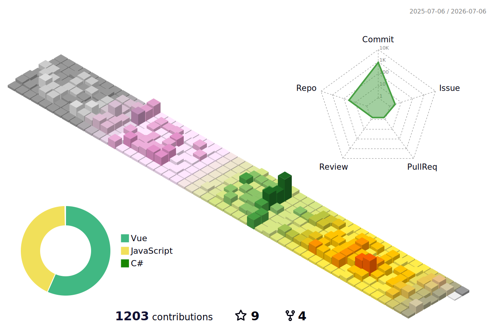

English | [中文](README_CN.md)

[](https://git.io/typing-svg)

<div style="display: grid;gap: 20px;grid-template-columns: repeat(auto-fit, minmax(240px, 1fr));">

[](https://metrics.lecoq.io/changweihua#gh-light-mode-only)

<div>

- 🔭 I’m currently working on maui-related
- 🌱 I’m currently learning 微信小程序开发
- 👯 I’m looking to collaborate on 副业
- 🤔 I’m looking for help with ...
- 💬 Ask me about ...
- 📫 How to reach me: changweihua@outlook.com
- 😄 Pronouns: ...
- ⚡ Fun fact: ...

</div>

</div>

#### :bar_chart: [月度工分](https://github.com/changweihua/wakapi)

<!--START_SECTION:wakao-->

```txt
Markdown                                   23 hrs 57 mins        🟩🟩🟩🟩🟩🟩🟩🟩⬜⬜⬜⬜⬜⬜⬜⬜⬜⬜⬜⬜⬜⬜⬜⬜⬜   32.14 %
Vue.js                                     8 hrs 56 mins         🟩🟩🟩⬜⬜⬜⬜⬜⬜⬜⬜⬜⬜⬜⬜⬜⬜⬜⬜⬜⬜⬜⬜⬜⬜   12.00 %
C#                                         8 hrs 46 mins         🟩🟩🟩⬜⬜⬜⬜⬜⬜⬜⬜⬜⬜⬜⬜⬜⬜⬜⬜⬜⬜⬜⬜⬜⬜   11.78 %
TypeScript                                 7 hrs 37 mins         🟩🟩🟨⬜⬜⬜⬜⬜⬜⬜⬜⬜⬜⬜⬜⬜⬜⬜⬜⬜⬜⬜⬜⬜⬜   10.22 %
Java                                       7 hrs 5 mins          🟩🟩🟨⬜⬜⬜⬜⬜⬜⬜⬜⬜⬜⬜⬜⬜⬜⬜⬜⬜⬜⬜⬜⬜⬜   09.52 %
```

<!--END_SECTION:wakao-->

#### Stats ####


| .                                                                                                                                            | .                                                                                                                                      | .                                                                                                                                                     |
| -------------------------------------------------------------------------------------------------------------------------------------------- | -------------------------------------------------------------------------------------------------------------------------------------- | ----------------------------------------------------------------------------------------------------------------------------------------------------- |
|  |  |  |


#### Contrib ####

<!--   profile-green-animate -->


<!--START_SECTION:waka-->


**我是早鸟 🐤** 

```text
🌞 早晨                     2997 commits        ██████████░░░░░░░░░░░░░░░   41.53 % 
🌆 白天                     2589 commits        █████████░░░░░░░░░░░░░░░░   35.87 % 
🌃 傍晚                     1429 commits        █████░░░░░░░░░░░░░░░░░░░░   19.80 % 
🌙 晚上                     202 commits         █░░░░░░░░░░░░░░░░░░░░░░░░   02.80 % 
```
📅 **星期二 时的我最有干劲** 

```text
星期一                      1086 commits        ████░░░░░░░░░░░░░░░░░░░░░   15.05 % 
星期二                      1278 commits        ████░░░░░░░░░░░░░░░░░░░░░   17.71 % 
星期三                      1270 commits        ████░░░░░░░░░░░░░░░░░░░░░   17.60 % 
星期四                      1121 commits        ████░░░░░░░░░░░░░░░░░░░░░   15.53 % 
星期五                      1157 commits        ████░░░░░░░░░░░░░░░░░░░░░   16.03 % 
星期六                      706 commits         ██░░░░░░░░░░░░░░░░░░░░░░░   09.78 % 
星期日                      599 commits         ██░░░░░░░░░░░░░░░░░░░░░░░   08.30 % 
```


📊 **本周消耗时间** 

```text
🕑︎ 时区: Asia/Shanghai

💬 编程语言: 
Java                     4 hrs 21 mins       ██████░░░░░░░░░░░░░░░░░░░   24.22 % 
XML                      3 hrs 38 mins       █████░░░░░░░░░░░░░░░░░░░░   20.19 % 
Markdown                 2 hrs 40 mins       ████░░░░░░░░░░░░░░░░░░░░░   14.81 % 
YAML                     1 hr 35 mins        ██░░░░░░░░░░░░░░░░░░░░░░░   08.79 % 
TypeScript               1 hr 11 mins        ██░░░░░░░░░░░░░░░░░░░░░░░   06.57 % 

🔥 编辑器: 
IntelliJ IDEA            9 hrs 6 mins        █████████████░░░░░░░░░░░░   50.58 % 
VS Code                  6 hrs 38 mins       █████████░░░░░░░░░░░░░░░░   36.88 % 
Visual Studio            2 hrs 15 mins       ███░░░░░░░░░░░░░░░░░░░░░░   12.55 % 

🐱‍💻 项目: 
tgs-solution             9 hrs 6 mins        █████████████░░░░░░░░░░░░   50.58 % 
TourGroupService         5 hrs 14 mins       ███████░░░░░░░░░░░░░░░░░░   29.05 % 
changweihua.github.io    3 hrs 34 mins       █████░░░░░░░░░░░░░░░░░░░░   19.83 % 
SSTS                     5 mins              ░░░░░░░░░░░░░░░░░░░░░░░░░   00.54 % 

💻 操作系统: 
Windows                  18 hrs 1 min        █████████████████████████   100.00 % 
```

**我最常使用 C#** 

```text
C#                       55 repos            ███████████░░░░░░░░░░░░░░   43.31 % 
Vue                      21 repos            ████░░░░░░░░░░░░░░░░░░░░░   16.54 % 
TypeScript               18 repos            ████░░░░░░░░░░░░░░░░░░░░░   14.17 % 
JavaScript               16 repos            ███░░░░░░░░░░░░░░░░░░░░░░   12.60 % 
Java                     3 repos             █░░░░░░░░░░░░░░░░░░░░░░░░   02.36 % 
```


<!--END_SECTION:waka-->


<!--  -->
