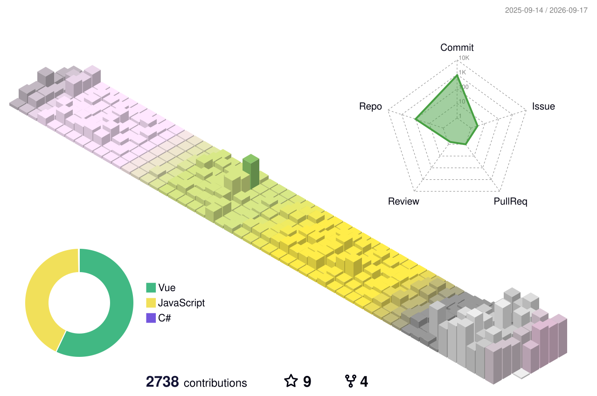

English | [中文](README_CN.md)

[](https://git.io/typing-svg)

<div style="display: grid;gap: 20px;grid-template-columns: repeat(auto-fit, minmax(240px, 1fr));">

<div>

- 🔭 I’m currently working on maui-related
- 🌱 I’m currently learning 微信小程序开发
- 👯 I’m looking to collaborate on 副业
- 🤔 I’m looking for help with ...
- 💬 Ask me about ...
- 📫 How to reach me: changweihua@outlook.com
- 😄 Pronouns: ...
- ⚡ Fun fact: ...

</div>

</div>

#### :bar_chart: [月度工分](https://github.com/changweihua/wakapi)

<!--START_SECTION:wakao-->

```txt
TypeScript        44 hrs 46 mins        🟩🟩🟩🟩🟩🟩🟩🟩🟩⬜⬜⬜⬜⬜⬜⬜⬜⬜⬜⬜⬜⬜⬜⬜⬜   36.67 %
Markdown          18 hrs 53 mins        🟩🟩🟩🟩⬜⬜⬜⬜⬜⬜⬜⬜⬜⬜⬜⬜⬜⬜⬜⬜⬜⬜⬜⬜⬜   15.47 %
Java              18 hrs 43 mins        🟩🟩🟩🟩⬜⬜⬜⬜⬜⬜⬜⬜⬜⬜⬜⬜⬜⬜⬜⬜⬜⬜⬜⬜⬜   15.33 %
JSON              11 hrs 35 mins        🟩🟩🟨⬜⬜⬜⬜⬜⬜⬜⬜⬜⬜⬜⬜⬜⬜⬜⬜⬜⬜⬜⬜⬜⬜   09.50 %
Vue               8 hrs                 🟩🟨⬜⬜⬜⬜⬜⬜⬜⬜⬜⬜⬜⬜⬜⬜⬜⬜⬜⬜⬜⬜⬜⬜⬜   06.56 %
```

<!--END_SECTION:wakao-->


#### Contrib ####

<!--   profile-green-animate -->


<!--START_SECTION:waka-->


**我是早鸟 🐤** 

```text
🌞 早晨                     3532 commits        ██████████░░░░░░░░░░░░░░░   41.64 % 
🌆 白天                     3244 commits        ██████████░░░░░░░░░░░░░░░   38.24 % 
🌃 傍晚                     1503 commits        ████░░░░░░░░░░░░░░░░░░░░░   17.72 % 
🌙 晚上                     204 commits         █░░░░░░░░░░░░░░░░░░░░░░░░   02.40 % 
```
📅 **星期二 时的我最有干劲** 

```text
星期一                      1300 commits        ████░░░░░░░░░░░░░░░░░░░░░   15.32 % 
星期二                      1570 commits        █████░░░░░░░░░░░░░░░░░░░░   18.51 % 
星期三                      1491 commits        ████░░░░░░░░░░░░░░░░░░░░░   17.58 % 
星期四                      1384 commits        ████░░░░░░░░░░░░░░░░░░░░░   16.31 % 
星期五                      1353 commits        ████░░░░░░░░░░░░░░░░░░░░░   15.95 % 
星期六                      746 commits         ██░░░░░░░░░░░░░░░░░░░░░░░   08.79 % 
星期日                      639 commits         ██░░░░░░░░░░░░░░░░░░░░░░░   07.53 % 
```


📊 **本周消耗时间** 

```text
🕑︎ 时区: Asia/Shanghai

💬 编程语言: 
TypeScript               19 hrs 3 mins       █████████████░░░░░░░░░░░░   52.06 % 
Java                     6 hrs 21 mins       ████░░░░░░░░░░░░░░░░░░░░░   17.38 % 
Markdown                 2 hrs 56 mins       ██░░░░░░░░░░░░░░░░░░░░░░░   08.04 % 
Kotlin                   2 hrs 2 mins        █░░░░░░░░░░░░░░░░░░░░░░░░   05.60 % 
CSS                      1 hr 52 mins        █░░░░░░░░░░░░░░░░░░░░░░░░   05.10 % 

🔥 编辑器: 
VS Code                  29 hrs 59 mins      ████████████████████░░░░░   81.96 % 
Android Studio           6 hrs 36 mins       █████░░░░░░░░░░░░░░░░░░░░   18.04 % 

🐱‍💻 项目: 
quiz                     30 hrs              █████████████████████░░░░   82.01 % 
rfidTrack                3 hrs 3 mins        ██░░░░░░░░░░░░░░░░░░░░░░░   08.36 % 
changweihua.github.io    1 hr 57 mins        █░░░░░░░░░░░░░░░░░░░░░░░░   05.35 % 
TourGroupService         51 mins             █░░░░░░░░░░░░░░░░░░░░░░░░   02.33 % 
WorkPulse                33 mins             ░░░░░░░░░░░░░░░░░░░░░░░░░   01.51 % 

💻 操作系统: 
Windows                  36 hrs 35 mins      █████████████████████████   100.00 % 
```

🤖 **AI Coding This Week** 

```text
⏱ AI Coding Time: 29 hrs 50 mins (81.56%)

✍️ 6,089 lines written by AI, 1,139 lines written by hand (84.24% AI-written)

🔤 11,001,459 Input Tokens, 520,461 Output Tokens

💵 $59.43 Estimated AI Cost This Week

🧠 96 AI Sessions, 276 AI Prompts

Mimo                     3,447 lines         █████████████░░░░░░░░░░░░   51.56 % 
Deepseek                 2,937 lines         ███████████░░░░░░░░░░░░░░   43.93 % 
Longcat                  301 lines           █░░░░░░░░░░░░░░░░░░░░░░░░   04.50 % 
Opencode-Cli             0 lines             ░░░░░░░░░░░░░░░░░░░░░░░░░   00.00 % 

🔎 AI Coding Insights:
🤖 AI-Driven — 84.24% of written lines came from AI
📄 Detailed Prompter — average 1,480 characters per prompt
🔁 Iterative Prompter — average 3 prompts per session
🚀 High AI Trust — 24.23% of changed lines were hand-edited
```

**我最常使用 C#** 

```text
C#                       56 repos            ██████████░░░░░░░░░░░░░░░   41.79 % 
Vue                      21 repos            ████░░░░░░░░░░░░░░░░░░░░░   15.67 % 
TypeScript               20 repos            ████░░░░░░░░░░░░░░░░░░░░░   14.93 % 
JavaScript               17 repos            ███░░░░░░░░░░░░░░░░░░░░░░   12.69 % 
Java                     6 repos             █░░░░░░░░░░░░░░░░░░░░░░░░   04.48 % 
```


<!--END_SECTION:waka-->


<!--  -->
