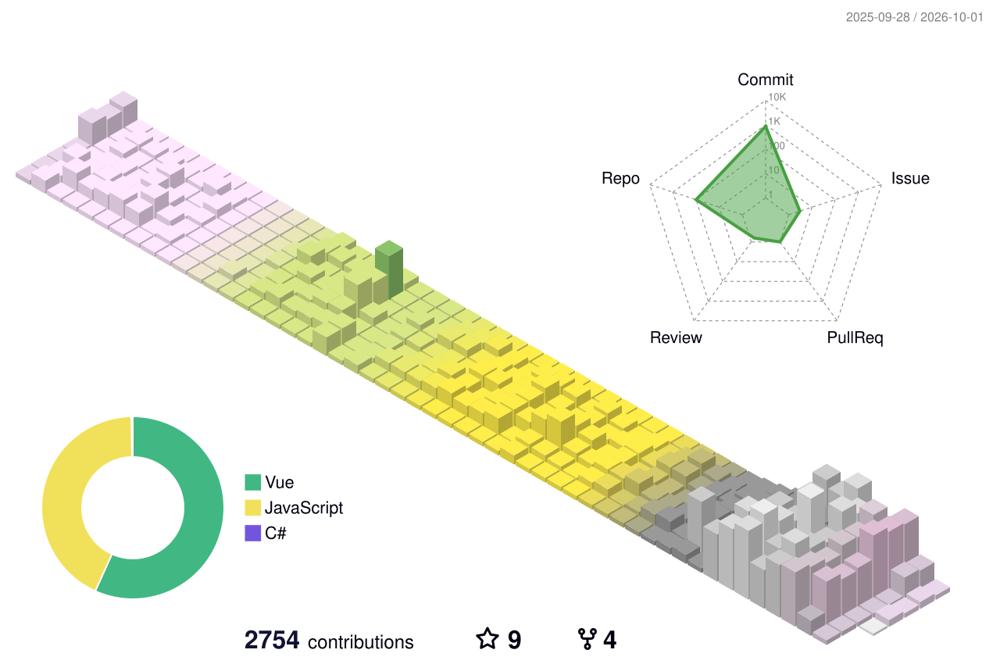

English | [中文](README_CN.md)

[](https://git.io/typing-svg)

<div style="display: grid;gap: 20px;grid-template-columns: repeat(auto-fit, minmax(240px, 1fr));">

<div>

- 🔭 I’m currently working on maui-related
- 🌱 I’m currently learning 微信小程序开发
- 👯 I’m looking to collaborate on 副业
- 🤔 I’m looking for help with ...
- 💬 Ask me about ...
- 📫 How to reach me: changweihua@outlook.com
- 😄 Pronouns: ...
- ⚡ Fun fact: ...

</div>

</div>

#### :bar_chart: [月度工分](https://github.com/changweihua/wakapi)

<!--START_SECTION:wakao-->

```txt
TypeScript        24 hrs 37 mins        🟩🟩🟩🟩🟩🟩⬜⬜⬜⬜⬜⬜⬜⬜⬜⬜⬜⬜⬜⬜⬜⬜⬜⬜⬜   24.74 %
Java              24 hrs 35 mins        🟩🟩🟩🟩🟩🟩⬜⬜⬜⬜⬜⬜⬜⬜⬜⬜⬜⬜⬜⬜⬜⬜⬜⬜⬜   24.70 %
Markdown          17 hrs 33 mins        🟩🟩🟩🟩🟨⬜⬜⬜⬜⬜⬜⬜⬜⬜⬜⬜⬜⬜⬜⬜⬜⬜⬜⬜⬜   17.63 %
Kotlin            8 hrs 6 mins          🟩🟩⬜⬜⬜⬜⬜⬜⬜⬜⬜⬜⬜⬜⬜⬜⬜⬜⬜⬜⬜⬜⬜⬜⬜   08.14 %
C#                7 hrs 24 mins         🟩🟩⬜⬜⬜⬜⬜⬜⬜⬜⬜⬜⬜⬜⬜⬜⬜⬜⬜⬜⬜⬜⬜⬜⬜   07.44 %
```

<!--END_SECTION:wakao-->


#### Contrib ####

<!--   profile-green-animate -->


<!--START_SECTION:waka-->


**我是早鸟 🐤** 

```text
🌞 早晨                     4517 commits        █████████░░░░░░░░░░░░░░░░   36.89 % 
🌆 白天                     4881 commits        ██████████░░░░░░░░░░░░░░░   39.86 % 
🌃 傍晚                     2630 commits        █████░░░░░░░░░░░░░░░░░░░░   21.48 % 
🌙 晚上                     216 commits         ░░░░░░░░░░░░░░░░░░░░░░░░░   01.76 % 
```
📅 **星期二 时的我最有干劲** 

```text
星期一                      1862 commits        ████░░░░░░░░░░░░░░░░░░░░░   15.21 % 
星期二                      2125 commits        ████░░░░░░░░░░░░░░░░░░░░░   17.36 % 
星期三                      2104 commits        ████░░░░░░░░░░░░░░░░░░░░░   17.18 % 
星期四                      1879 commits        ████░░░░░░░░░░░░░░░░░░░░░   15.35 % 
星期五                      2015 commits        ████░░░░░░░░░░░░░░░░░░░░░   16.46 % 
星期六                      1214 commits        ██░░░░░░░░░░░░░░░░░░░░░░░   09.92 % 
星期日                      1045 commits        ██░░░░░░░░░░░░░░░░░░░░░░░   08.53 % 
```


📊 **本周消耗时间** 

```text
🕑︎ 时区: Asia/Shanghai

💬 编程语言: 
Markdown                 1 hr 4 mins         ████████████████░░░░░░░░░   64.86 % 
Java                     23 mins             ██████░░░░░░░░░░░░░░░░░░░   23.79 % 
JSON                     8 mins              ██░░░░░░░░░░░░░░░░░░░░░░░   08.93 % 
YAML                     2 mins              █░░░░░░░░░░░░░░░░░░░░░░░░   02.12 % 
Binary                   0 secs              ░░░░░░░░░░░░░░░░░░░░░░░░░   00.30 % 

🔥 编辑器: 
VS Code                  1 hr 35 mins        ████████████████████████░   96.16 % 
Visual Studio            3 mins              █░░░░░░░░░░░░░░░░░░░░░░░░   03.84 % 

🐱‍💻 项目: 
changweihua.github.io    1 hr 10 mins        ██████████████████░░░░░░░   70.25 % 
quiz                     25 mins             ██████░░░░░░░░░░░░░░░░░░░   25.91 % 
DeepSeekSolution         3 mins              █░░░░░░░░░░░░░░░░░░░░░░░░   03.84 % 

💻 操作系统: 
Windows                  1 hr 39 mins        █████████████████████████   100.00 % 
```

🤖 **AI Coding This Week** 

```text
No AI Coding Activity Tracked This Week
```

**我最常使用 C#** 

```text
C#                       57 repos            ██████████░░░░░░░░░░░░░░░   41.91 % 
TypeScript               20 repos            ████░░░░░░░░░░░░░░░░░░░░░   14.71 % 
JavaScript               17 repos            ███░░░░░░░░░░░░░░░░░░░░░░   12.50 % 
Java                     6 repos             █░░░░░░░░░░░░░░░░░░░░░░░░   04.41 % 
Python                   1 repo              ░░░░░░░░░░░░░░░░░░░░░░░░░   00.74 % 
```


<!--END_SECTION:waka-->


<!--  -->
