English | [中文](README_CN.md)

<!--   my-ticker -->

<!--   grid-snake -->
<!--  -->

<!--START_SECTION:waka-->
<!--END_SECTION:waka-->

<!--   profile-green-animate -->

| .                                                                                                                                            | .                                                                                                                                      | .                                                                                                                                                     |
| -------------------------------------------------------------------------------------------------------------------------------------------- | -------------------------------------------------------------------------------------------------------------------------------------- | ----------------------------------------------------------------------------------------------------------------------------------------------------- |
|  |  |  |

<!-- metrics -->

<!--
**changweihua/changweihua** is a ✨ _special_ ✨ repository because its `README.md` (this file) appears on your GitHub profile.

Here are some ideas to get you started:

- 🔭 I’m currently working on ...
- 🌱 I’m currently learning ...
- 👯 I’m looking to collaborate on ...
- 🤔 I’m looking for help with ...
- 💬 Ask me about ...
- 📫 How to reach me: ...
- 😄 Pronouns: ...
- ⚡ Fun fact: ...
-->

<!-- - 🔭 I’m currently working on 苏南硕放机场阳光服务平台
- 🌱 I’m currently learning 微信小程序开发
- 👯 I’m looking to collaborate on 副业
- 🤔 I’m looking for help with ...
- 💬 Ask me about ...
- 📫 How to reach me: 微信号 changweihua2011
- 😄 Pronouns: ...
- ⚡ Fun fact: ... -->

