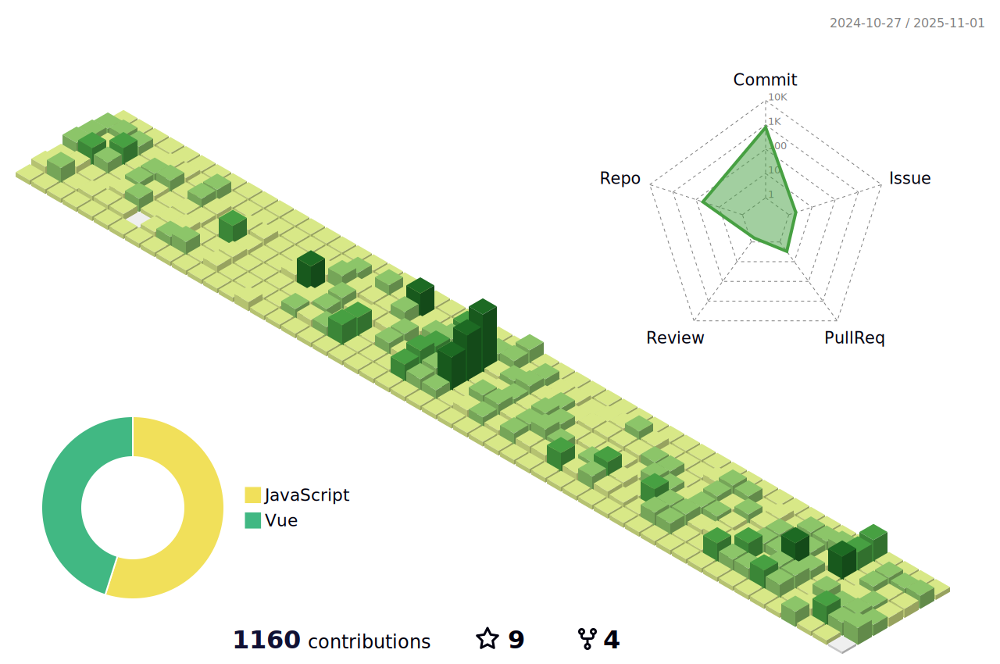

English | [中文](README_CN.md)


<!--   my-ticker -->
[](https://git.io/typing-svg)

<!--   grid-snake -->
<!--  -->


<!--START_SECTION:waka-->


**我是早起的 🐤** 

```text
🌞 早晨                     2377 commits        █████████░░░░░░░░░░░░░░░░   36.75 % 
🌆 白天                     2480 commits        ██████████░░░░░░░░░░░░░░░   38.34 % 
🌃 傍晚                     1413 commits        █████░░░░░░░░░░░░░░░░░░░░   21.85 % 
🌙 晚上                     198 commits         █░░░░░░░░░░░░░░░░░░░░░░░░   03.06 % 
```
📅 **我最有效率是在 星期二** 

```text
星期一                      991 commits         ████░░░░░░░░░░░░░░░░░░░░░   15.32 % 
星期二                      1232 commits        █████░░░░░░░░░░░░░░░░░░░░   19.05 % 
星期三                      1127 commits        ████░░░░░░░░░░░░░░░░░░░░░   17.42 % 
星期四                      1016 commits        ████░░░░░░░░░░░░░░░░░░░░░   15.71 % 
星期五                      1011 commits        ████░░░░░░░░░░░░░░░░░░░░░   15.63 % 
星期六                      598 commits         ██░░░░░░░░░░░░░░░░░░░░░░░   09.25 % 
星期日                      493 commits         ██░░░░░░░░░░░░░░░░░░░░░░░   07.62 % 
```


📊 **本周消耗时间** 

```text
🕑︎ 时区: Asia/Shanghai

💬 编程语言: 
TypeScript               7 hrs 42 mins       █████████░░░░░░░░░░░░░░░░   37.96 % 
Vue.js                   7 hrs 36 mins       █████████░░░░░░░░░░░░░░░░   37.47 % 
JSON                     2 hrs 28 mins       ███░░░░░░░░░░░░░░░░░░░░░░   12.16 % 
Less                     1 hr 17 mins        ██░░░░░░░░░░░░░░░░░░░░░░░   06.34 % 
Other                    49 mins             █░░░░░░░░░░░░░░░░░░░░░░░░   04.04 % 

🔥 编辑器: 
VS Code                  20 hrs 17 mins      █████████████████████████   100.00 % 

🐱‍💻 项目: 
NewLifeApp               7 hrs 44 mins       ██████████░░░░░░░░░░░░░░░   38.16 % 
changweihua.github.io    3 hrs 18 mins       ████░░░░░░░░░░░░░░░░░░░░░   16.29 % 
ToolsApproval            2 hrs 35 mins       ███░░░░░░░░░░░░░░░░░░░░░░   12.79 % 
maui-shell               2 hrs 29 mins       ███░░░░░░░░░░░░░░░░░░░░░░   12.29 % 
maui-vant                2 hrs 27 mins       ███░░░░░░░░░░░░░░░░░░░░░░   12.10 % 

💻 操作系统: 
Windows                  20 hrs 17 mins      █████████████████████████   100.00 % 
```

**我最常使用 C#** 

```text
C#                       50 repos            ███████████░░░░░░░░░░░░░░   44.64 % 
TypeScript               17 repos            ████░░░░░░░░░░░░░░░░░░░░░   15.18 % 
Vue                      17 repos            ████░░░░░░░░░░░░░░░░░░░░░   15.18 % 
CSS                      2 repos             ░░░░░░░░░░░░░░░░░░░░░░░░░   01.79 % 
C++                      1 repo              ░░░░░░░░░░░░░░░░░░░░░░░░░   00.89 % 
```


 Last Updated on 22/04/2025 07:58:12 UTC
<!--END_SECTION:waka-->


<!--   profile-green-animate -->


| .                                                                                                                                            | .                                                                                                                                      | .                                                                                                                                                     |
| -------------------------------------------------------------------------------------------------------------------------------------------- | -------------------------------------------------------------------------------------------------------------------------------------- | ----------------------------------------------------------------------------------------------------------------------------------------------------- |
|  |  |  |


<!-- metrics -->


<!--
**changweihua/changweihua** is a ✨ _special_ ✨ repository because its `README.md` (this file) appears on your GitHub profile.

Here are some ideas to get you started:

- 🔭 I’m currently working on ...
- 🌱 I’m currently learning ...
- 👯 I’m looking to collaborate on ...
- 🤔 I’m looking for help with ...
- 💬 Ask me about ...
- 📫 How to reach me: ...
- 😄 Pronouns: ...
- ⚡ Fun fact: ...
-->

<!-- - 🔭 I’m currently working on 苏南硕放机场阳光服务平台
- 🌱 I’m currently learning 微信小程序开发
- 👯 I’m looking to collaborate on 副业
- 🤔 I’m looking for help with ...
- 💬 Ask me about ...
- 📫 How to reach me: 微信号 changweihua2011
- 😄 Pronouns: ...
- ⚡ Fun fact: ... -->


